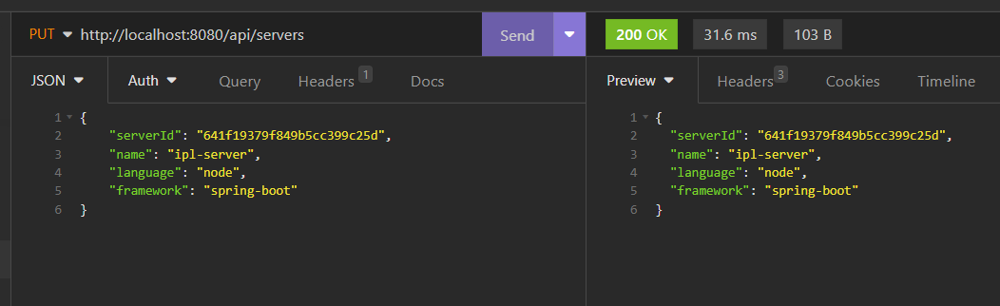

# Server: 
### Project Description
- This is a Java application built with Spring Boot that provides a REST API for managing "server" objects. The application uses MongoDB as the backend database to store the server objects.  
- The API is fully tested and comes with appropriate error handling and logging to ensure reliability, accuracy, better debugging.  
- The project also incorporates JUnit testing for REST API endpoints.  
- This project provides a complete solution to the task and includes detailed documentation and code examples to help you get started. Feel free to clone, fork, or modify this repository to suit your needs.  

## REST API Endpoints
#### 1. Get list of all servers
- URL: `/api/servers`
- Method: GET
- Description: Returns a list of all server documents.
- Screenshot of API Request from Insomnia client tool:


#### 2. Get server by ID
- URL: `/api/servers/{serverId}`
- Method: GET
- Description: Returns a server document by its ID.
- Screenshot of API Request from Insomnia client tool:


#### 3. Get list of servers by name
- URL: `/api/servers/name/{name}`
- Method: GET
- Description: Returns a list servers document by name.
- Screenshot of API Request from Insomnia client tool:
  

#### 4. Add server
- URL: `/api/servers`
- Method: POST
- Description: Adds a new server document.
- Screenshot of API Request from Insomnia client tool:
  

#### 5. Update server
- URL: `/api/servers`
- Method: PUT
- Description: Updates an existing server document.
- Screenshot of API Request from Insomnia client tool:
  

#### 6. Delete server by ID
- URL: `/api/servers/{serverId}`
- Method: DELETE
- Description: Deletes a server document by its ID.
- Screenshot of API Request from Insomnia client tool:
  

### Request and Response
- All requests and responses are in JSON format.

## Server document example

```json
{
	"_id": "641f19379f849b5cc399c25d",
	"name": "payments-server",
	"language": "C#",
	"framework": ".NET"
}
```

## JUnit Testing
#### The application includes the following 6 JUnit test methods to test the REST endpoints:  

- `deleteServerByIdTest()`: This method tests the `DELETE` endpoint to delete a server by its ID. It verifies that the server is deleted successfully and returns the expected status code.  
- `updateServerTest()`:  This method tests the `PUT` endpoint to update a server's information. It verifies that the server information is updated correctly and returns the expected status code.
- `getServerByName()`: This method tests the `GET` endpoint to retrieve a server's information by its name. It verifies that the server information is returned correctly and returns the expected status code.  
- `getServerByIDTest()`: This method tests the `GET` endpoint to retrieve a server's information by its ID. It verifies that the server information is returned correctly and returns the expected status code.  
- `getAllServersTest()`: This method tests the `GET` endpoint to retrieve all servers' information. It verifies that all server information is returned correctly and returns the expected status code.  
- `addServerTest()`: This method tests the `POST` endpoint to add a new server. It verifies that the server is added successfully and returns the expected status code.  

### Sample Test Results
  


# Client
### Project Description
This project combines a Java Spring Boot REST API with a React web UI.
The app allow the user to create, show, and delete documents of Server collection. Below are the screenshots of these features in action.

## Screenshots
#### 1. Show All Servers Documents  


#### 2. Delete a Server Document
Click the Delete button  


Confirm to delete  


Document deleted  


#### 3. Add a new Server Document
Click on Add Server button  


Fill the name, language and framework field in Add Server DialogBox form  


Document added  


## Setup and run:

#### Step 1: Spin the Spring Boot Application created in Task 1(`https://github.com/Dev-Bilaspure/ServerVault-Assessment-Task-1`)
#### Step 2: Clone this repository to your local machine
#### Step 3: Install dependencies with `npm install`
#### Step 4: Start the development server with `npm run start`
#### Step 5: Open your browser to `http://localhost:3000`


## Dependencies
- Axios
- Material UI
- React  
Note: These are the major dependencies used in the project. For a complete list of dependencies and their versions, please refer to the `package.json` file.

## State Managment
- React Context API is used for state managment.
