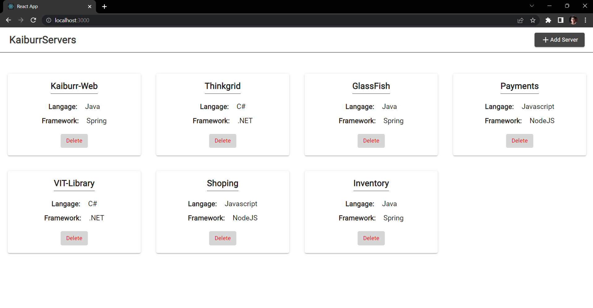
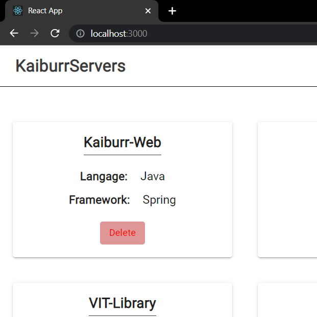
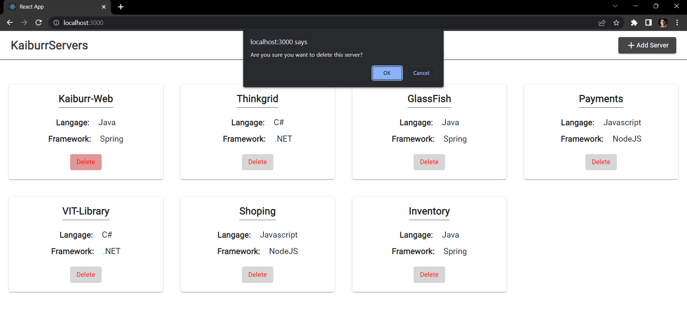
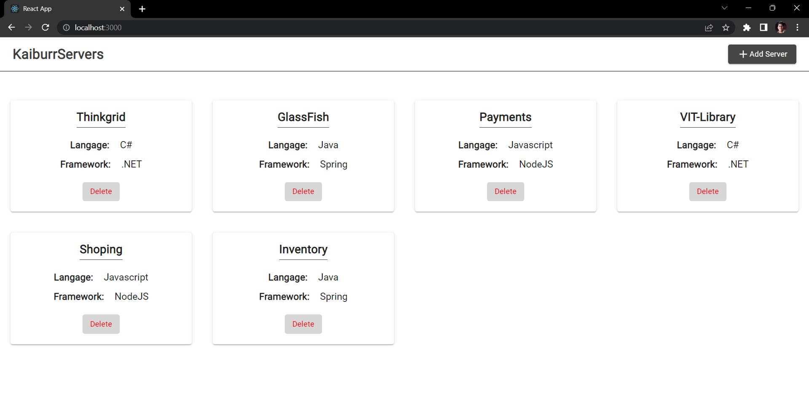
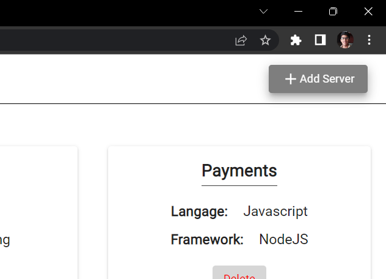
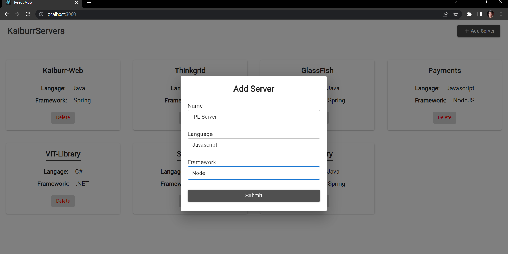
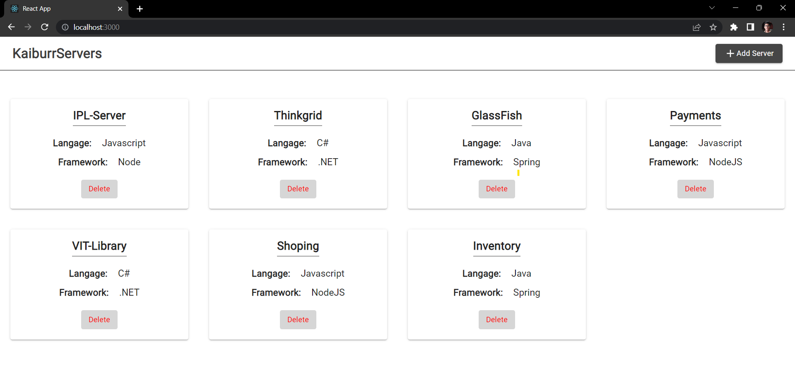

### Project Description
This project combines a Java Spring Boot REST API with a React web UI.
The app allow the user to create, show, and delete documents of Server collection. Below are the screenshots of these features in action.

## Screenshots
#### 1. Show All Servers Documents  

#### 2. Delete a Server Document
Click the Delete button  

Confirm to delete  

Document deleted  

#### 3. Add a new Server Document
Click on Add Server button  

Fill the name, language and framework field in Add Server DialogBox form  

Document added  

## Setup and run:

#### Step 1: Spin the Spring Boot Application created in Task 1(`https://github.com/Dev-Bilaspure/ServerVault-Assessment-Task-1`)
#### Step 2: Clone this repository to your local machine
#### Step 3: Install dependencies with `npm install`
#### Step 4: Start the development server with `npm run start`
#### Step 5: Open your browser to `http://localhost:3000`

## Dependencies
- Axios
- Material UI
- React  
Note: These are the major dependencies used in the project. For a complete list of dependencies and their versions, please refer to the `package.json` file.

## State Managment
- React Context API is used for state managment.